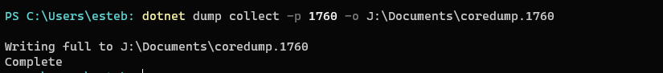
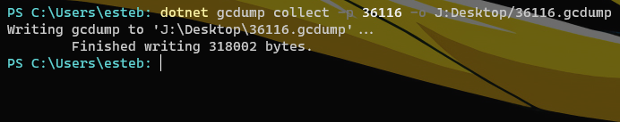
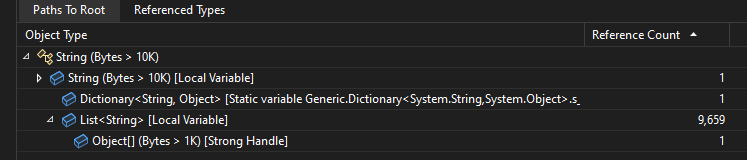

If you need to profile a running application that is not running on VisualStudio you can use [.NET Core diagnostic global tools](https://learn.microsoft.com/en-us/dotnet/core/diagnostics/#net-core-diagnostic-global-tools) which includes:

* dotnet-counters

    dotnet-counters is a performance monitoring tool for first-level health monitoring and performance investigation. It observes performance counter values published via the EventCounter API. For example, you can quickly monitor things like CPU usage or the rate of exceptions being thrown in your .NET Core application.

* dotnet-dump

    The dotnet-dump tool is a way to collect and analyze Windows and Linux core dumps without a native debugger.

* dotnet-gcdump

    The dotnet-gcdump tool is a way to collect GC (Garbage Collector) dumps of live .NET processes.

* dotnet-monitor

    The dotnet-monitor tool is a way to monitor .NET applications in production environments and to collect diagnostic artifacts (for example, dumps, traces, logs, and metrics) on-demand or using automated rules for collecting under specified conditions.

* dotnet-trace

    .NET Core includes what is called the EventPipe through which diagnostics data is exposed. The dotnet-trace tool allows you to consume interesting profiling data from your app that can help in scenarios where you need to root cause apps running slow.

* dotnet-stack

    The dotnet-stack tool allows you to quickly print the managed stacks for all threads in a running .NET process.

* dotnet-symbol

    dotnet-symbol downloads files (symbols, DAC/DBI, host files, etc.) needed to open a core dump or minidump. Use this tool if you need symbols and modules to debug a dump file captured on a different machine.

* dotnet-sos

    dotnet-sos installs the SOS debugging extension on Linux and macOS (and on Windows if you're using Windbg/cdb).

* PerfCollect

    PerfCollect is a bash script you can use to collect traces with perf and LTTng for more in-depth performance analysis of .NET apps running on Linux distributions.

In this case, we are going to focus on dotnet-counters, dotnet-dump, and dotnet-gcdump

## Setup

Before running our [Sample Code](https://gist.github.com/egonzalezt/ce6f6a5540fe1186efd0a9a80f4d02f3) you need to install the following tools:

### dotnet-counters
```bash
dotnet tool install --global dotnet-counters
```

### dotnet-dump
```bash
dotnet tool install --global dotnet-dump
```

### dotnet-gcdump
```bash
dotnet tool install --global dotnet-gcdump
```

## Monitoring memory usage

The required tools mentioned before need the PID of your .NET application to get the PID run:

```bash
dotnet counters ps
```


To examine the current memory usage of the process run:

```bash
dotnet counters monitor -p <PID>
```


:::info
The PID of the application shown in the different images may vary because the application is restarted multiple times to avoid high memory consumption.
:::

## [dotnet-dump](https://learn.microsoft.com/en-us/dotnet/core/diagnostics/dotnet-dump)

To run dotnet-dump you may have the PID to run the following code:

```bash
dotnet dump collect -p <PID> -o /your/path/coredump.<PID>
```



To analyze the generated coredump, use `dotnet dump analyze`

If we want to find managed objects within the GC heap that caused a memory leak, the dumpheap -stat command provides the overall statistics about the managed heap.


In this case, at the end of the results, we found a total of `4,818` on the method table(MT) of class `System. String` with a size of `63,990,168` bytes


Now we found a possible candidate to analyze to get the references that keeps these objects alive:

```bash
dumpheap -type System.String
```


At the end of the list, we found two possible candidates:

```bash
7ff9c99e5c18     5        400 System.Collections.Generic.Dictionary<System.String, System.String>
7ff9c99cba30    27     34,496 System.String[]
7ff9c99b69b8 4,818 63,990,168 System.String
Total 4,864 objects, 64,026,184 bytes
```

The results have a sense of knowing that our code creates a list of strings and stores a very long strong.

Use the `gcroot` command to print the chain of references that are keeping those objects alive


Running the command `gcroot 026cddf8e028` we get the following result:

```bash {7-10,25-28,31-34} showLineNumbers
> gcroot 026cddf8e028
Caching GC roots may take a while.
Subsequent runs of this command will be faster.

HandleTable:
    0000026cd74213e8 (strong handle)
          -> 0000026cf1021018 System.Object[]
          -> 0000026cd90750a8 System.Collections.Generic.List<System.String>
          -> 0000026cdb7d24b8 System.String[]
          -> 0000026cddf8e028 System.String

Thread ab4:
    97f037e5a0 7ff9c9ac4489 Program.Main() [C:\Users\esteb\source\repos\ConsoleApp1\ConsoleApp1\Program.cs @ 10]
        rbp+28: 00000097f037e5c8
          -> 0000026cddf8e028 System.String

        rbp+30: 00000097f037e5d0
          -> 0000026cd90750a8 System.Collections.Generic.List<System.String>
          -> 0000026cdb7d24b8 System.String[]
          -> 0000026cddf8e028 System.String

Thread 3acc:
    97effff970 7ffa289ab7f1 System.Threading.PortableThreadPool+GateThread.GateThreadStart() [/_/src/libraries/System.Private.CoreLib/src/System/Threading/PortableThreadPool.GateThread.cs @ 48]
        r14:
          -> 0000026cf1021018 System.Object[]
          -> 0000026cd90750a8 System.Collections.Generic.List<System.String>
          -> 0000026cdb7d24b8 System.String[]
          -> 0000026cddf8e028 System.String

        rbp-98: 00000097effffa18
          -> 0000026cf1021018 System.Object[]
          -> 0000026cd90750a8 System.Collections.Generic.List<System.String>
          -> 0000026cdb7d24b8 System.String[]
          -> 0000026cddf8e028 System.String

Found 5 unique roots.
```

If you check the `highlighted` blocks we finally found the reason why the memory is increasing and is not released by the GC, in this case, the objects:

```bash
System.Collections.Generic.List<System.String>
-> 0000026cdb7d24b8 System.String[]
-> 0000026cddf8e028 System.String
```

are responsible for the memory leak, which means that we need to find a list of strings that are producing the leak in our [Code](https://gist.github.com/egonzalezt/ce6f6a5540fe1186efd0a9a80f4d02f3)

## [dotnet-gcdump](https://devblogs.microsoft.com/dotnet/collecting-and-analyzing-memory-dumps/)

Another alternative to dotnet-dump is dotnet-gcdump which also allows you to track object allocation and memory leaks from a running application process.

To capture a GC dump `snapshot` from the target process, use `dotnet gcdump collect`. You can take multiple snapshots from the same process while it's running.

```bash
dotnet counters ps
dotnet gcdump collect -p <PID> -o /your/custom/path/<PID>.gcdump
```



This command creates a file with the extension `.gcdump` that can be opened with VisualStudio


In this case, our biggest object is `List<String>` of size `193,442,434 byes` if you click on that object VisualStudio gives the PathToRoot and the results are the same as the first method using dotnet-dump, a list of strings are the responsible:



If you don't have VisualStudio there is another alternative to see the results, using [PerfView](https://github.com/microsoft/perfview), to download please [follow the instructions](https://github.com/microsoft/perfview/blob/main/documentation/Downloading.md)

Opening the program you can choose your `.gcdump` file


Select the option `heapstacks`


And again the results are the same as shown in VisualStudio


:::tip
The main reason why this code never releases memory is that when GC starts the process of Collecting Garbage, the `List<String>` is still being used by the process and cannot be deleted, for that reason, the list passes to the different generations Gen 0 > Gen 1 > Gen 2 or LOH, is important to keep in mind when the objects are going to be destroyed to avoid these problems.
:::

## References

* [PerfView](https://github.com/dotnet/performance/blob/main/docs/profiling-workflow-dotnet-runtime.md#perfview)
* [Performance Profiling of .NET Core 3 applications on Linux with dotnet-trace and PerfView](https://michaelscodingspot.com/dotnet-trace/)
* [Identifying Memory Leaks with dotnet-dump and dotnet-gcdump](https://developer.samsung.com/tizen/blog/en-us/2020/07/31/identifying-memory-leaks-with-dotnet-dump-and-dotnet-gcdump)
* [.NET Core diagnostic global tools](https://learn.microsoft.com/en-us/dotnet/core/diagnostics/#net-core-diagnostic-global-tools)
