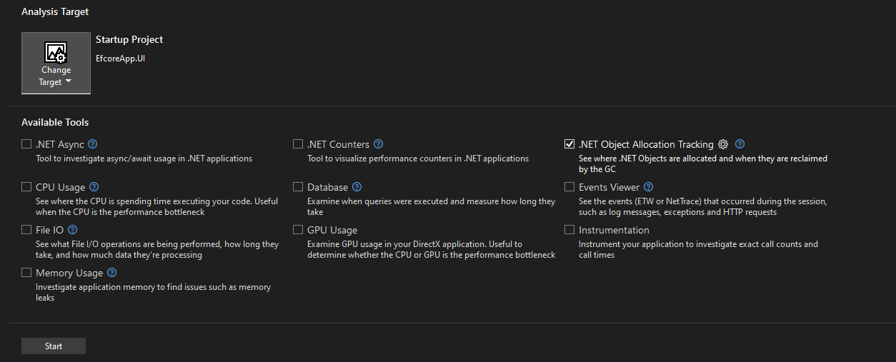
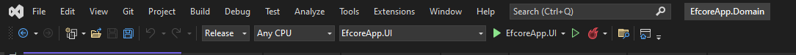
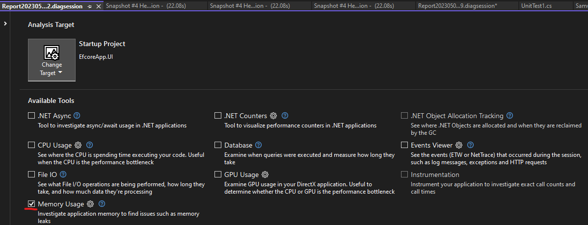
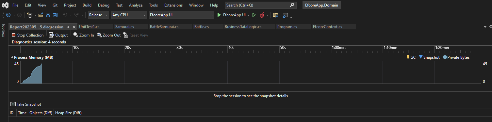
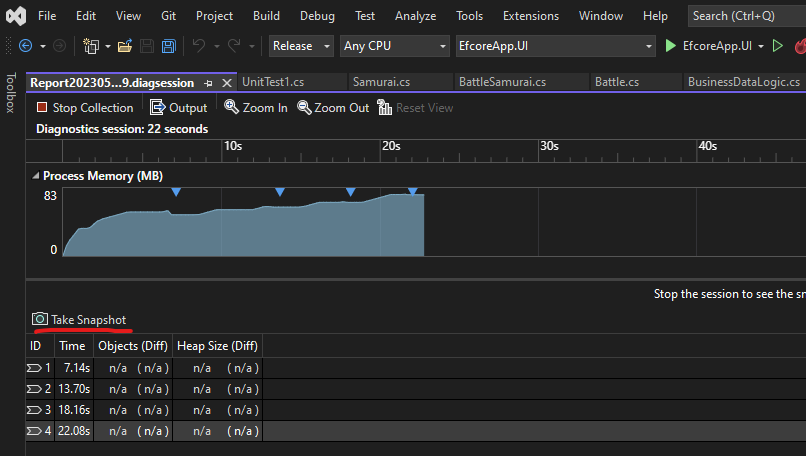
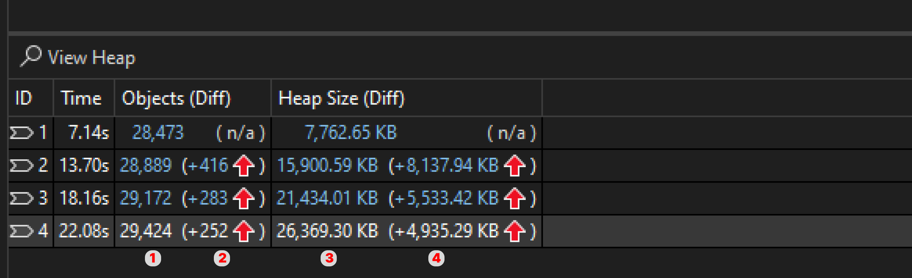
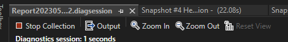
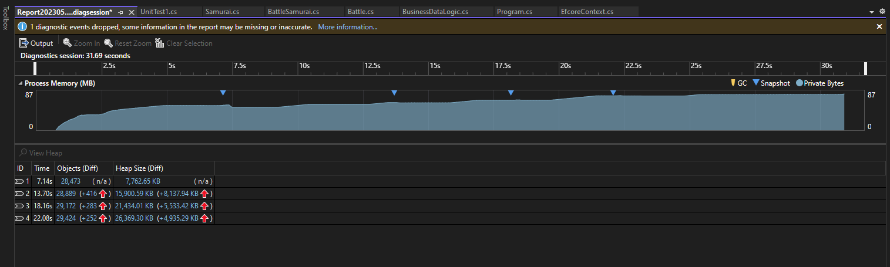
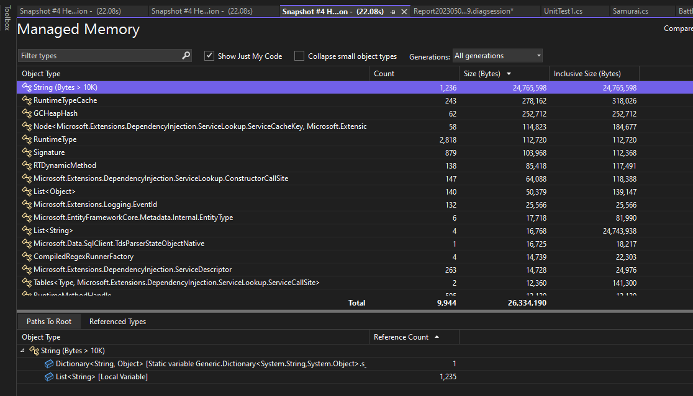
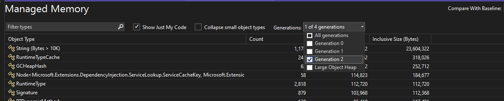

Select Alt+F2 to open the Performance Profiler in Visual Studio.



Tools in the Performance Profiler are intended to provide analysis for Release builds. In the Performance Profiler, you can collect diagnostic info while the app is running, and then examine the collected information after the app is stopped (a post-mortem analysis).

Tools available in the Performance Profiler include:

* CPU usage
* .NET object allocation
* Memory usage
* .NET async tool
* Instrumentation
* File I/O
* .NET Counters
* Database tool
* GPU usage

## Example with Memory Usage:

### Setup

Is important to setup your application in release mode



Then start the profiler with Memory Usage Option



When application starts you can se a plot with the metrics about memory usage of your application



### Snapshots

Now your application is ready to take snapshots so see the if there is any memory leak

:::tip

Is important to take snapshots when you see on the plot(Process Memory (Mb)) any significant increase on the memory

You can take snapshots during a diagnostic session to capture memory usage at particular moments. It's good to get a baseline snapshot of an app before a memory issue appears. You can take another snapshot after the first occurrence of the problem, and additional snapshots if you can repeat the scenario.
:::



The numbers in the Snapshot panes show the objects and bytes in memory when each snapshot was taken, and the difference between the snapshot and the previous one.



| Number                          | Description |
|---------------------------------|--------|
| 1 | The total number of objects in memory when the snapshot was taken. Select this link to display a snapshot details report sorted by the count of instances of the types.|
| 2 | The difference between the total number of memory objects in this snapshot and the previous snapshot.|
| 3 | The total number of bytes in memory when the snapshot was taken.|
| 4 | The difference between the total size of memory objects in this snapshot and the previous snapshot. A positive number means the memory size of this snapshot is larger than the previous one, and a negative number means the size is smaller. Baseline means a snapshot is the first in a diagnostic session. No Difference means the difference is zero.|

On each snapshot you can select the link to display a snapshot diff report.

### Results

When you finish taking snapshots you can stop the process and see the results



The results can show all the details of the different process, libraries or dependencies that your application may need to run



You can see the results base on the Objects or Heap Size, in this case if you choose one option located in HeapSize you will see the following result



In this case the object that consumes a lot of memory is a String using `24,768,598 bytes`, and if you see the button of the picture the application can show you the allocation tree that shows the functions or methods, in this case the possible leak is cause by a `List<String>`.

:::danger

Objects that cannot be deleted will be sent to `LOH`, the larger the memory size of the Large Object Heap, more expensive it will be to clean and destroy the Generation 2 and the LOH objects.

:::

Finally you can see the different generations of the GC to detect if there is any possible problem with memory release or object destruction during the application runtime



In this case there are too many object type `string` which means that your application is not releasing strings and thats mens when the GC runs it does not detect any object to destroy, this reason is explained on the section [Performance Testing examples](/docs/PerformanceTesting/#examples)

Also this example explains how [Generations](/docs/GC/Generations) works because string is normally a short lived object that starts on **Generation 0** but in this case these strings located on a `List<string>` cannot be destroyed so are send it into **Generation 1** but the list grows more and more and is not destroyed send it into **Generation 2**.

If the list grows more reaching a size of `85,000` or more bytes are send it into the `LOH`

## Code 

Code used for this example: 

```csharp showLineNumbers 
internal class Program
{
    static readonly List<string> list = new();

    private static void Main()
    {
        while (true)
        {
            list.Add(GenRandomStr(10000));
            Thread.Sleep(1);
        }
    }

    static readonly Random rnd = new();

    static string GenRandomStr(int length)
    {
        var chars = new List<char>();

        for (var i = 0; i < length; i++)
        {
            var a = (char)rnd.Next(65, 122);
            chars.Add(a);
        }

        return string.Concat(chars);
    }
}
```
:::note
[**Source code**](https://gist.github.com/egonzalezt/ce6f6a5540fe1186efd0a9a80f4d02f3)
:::

# References

[Analyze memory usage without debugging in the Performance Profiler (C#, Visual Basic, C++, F#)](https://learn.microsoft.com/en-us/visualstudio/profiling/memory-usage-without-debugging2?view=vs-2022)