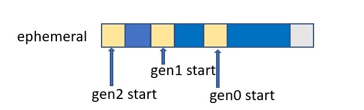

# Generations

In the .NET garbage collector, generations are used to categorize objects based on their age and determine when they should be collected. The garbage collector divides the heap into three generations: 0, 1, and 2.

## Generation 0

This generation is the youngest and contains short-lived objects. An example of a short-lived object is a temporary variable. Garbage collection occurs most frequently in this generation.

**Newly allocated objects** form a new generation of objects and are implicitly generation 0 collections. However, if they're large objects, they go on the large object heap (LOH).

Most objects are reclaimed for garbage collection in generation 0 and don't survive to the next generation.

### Allocating objects

If an application attempts to create a new object when generation 0 is full, the garbage collector performs a collection to free address space for the object. The garbage collector starts by examining the objects in generation 0 rather than all objects in the managed heap. A collection of generation 0 alone often reclaims enough memory to enable the application to continue creating new objects.

Garbage collections occur in specific generations as conditions warrant. Collecting a generation means collecting objects in that generation and all its younger generations. A generation 2 garbage collection is also known as a full garbage collection because it reclaims objects in all generations (that is, all objects in the managed heap).

## Generation 1

This generation contains short-lived objects and serves as a buffer between short-lived objects and long-lived objects.

After the garbage collector performs a collection of generation 0, it compacts the memory for the reachable objects and promotes them to generation 1. Because objects that survive collections tend to have longer lifetimes, it makes sense to promote them to a higher generation. The garbage collector doesn't have to reexamine the objects in generations 1 and 2 each time it performs a collection of generation 0.

If a collection of generation 0 doesn't reclaim enough memory for the application to create a new object, the garbage collector can perform a collection of generation 1 and then generation 2. Objects in generation 1 that survive collections are promoted to generation 2.

## Generation 2

This generation contains long-lived objects. An example of a long-lived object is an object in a server application that contains static data that's live for the duration of the process.

Objects in generation 2 that survive a collection **remain in generation 2** until they're determined to be unreachable in a future collection.

Objects on the large object heap (which is sometimes referred to as generation 3) are also collected in generation 2.

## Survival and promotions

Objects that aren't reclaimed in a garbage collection are known as survivors and are promoted to the next generation:

* Objects that survive a generation 0 garbage collection are promoted to generation 1.

* Objects that survive a generation 1 garbage collection are promoted to generation 2.

* Objects that survive a generation 2 garbage collection remain in generation 2.

**When the garbage collector detects that the survival rate is high in a generation**, it increases the threshold of allocations for that generation. The next collection gets a substantial size of reclaimed memory. The CLR continually balances two priorities: 

* Not letting an application's working set get too large by delaying garbage collection 
* Not letting the garbage collection run too frequently.

## Memory size of each generation

Garbage collection of a generation implies the garbage collection of all its younger generations. This means that all the objects in that particular generation and its younger generations are released. Because of this reason, the garbage collection of generation 2 is called a full garbage collection as all the objects in the heap memory are.released. Also, the memory allocated to the Generation 2 will be greater than Generation 1’s memory and similarly the memory of Generation 1 will be greater than Generation 0’s memory(Generation 2 > Generation 1 > Generation 0).

## Ephemeral generations and segments

Because objects in generations 0 and 1 are short-lived, these generations are known as the ephemeral generations.

Ephemeral generations are allocated in the memory segment that's known as the ephemeral segment. Each new segment acquired by the garbage collector becomes the new ephemeral segment and contains the objects that survived a generation 0 garbage collection. The old ephemeral segment becomes the new generation 2 segment.

Workstation/server GC	32-bit	64-bit
Workstation GC	16 MB	256 MB
Server GC	64 MB	4 GB
Server GC with > 4 logical CPUs	32 MB	2 GB
Server GC with > 8 logical CPUs	16 MB	1 GB

| Workstation/server GC           | 32-bit | 64-bit |
|---------------------------------|--------|--------|
| Workstation GC                  | 16 MB  | 256 MB |
| Server GC                       | 64 MB  | 4 GB   |
| Server GC with > 4 logical CPUs | 32 MB  | 2 GB   |
| Server GC with > 8 logical CPUs | 16 MB  | 1 GB   |

## When GC cleans a specific generation

Specific generations are cleaned depending on the threshold set for each generation. When an object is allocated, it is placed in the youngest generation (generation 0). When the generation 0 threshold is reached, a garbage collection is triggered, and all live objects in generation 0 are promoted to generation 1.

When the generation 1 threshold is reached, a garbage collection is triggered, and all live objects in generation 1 are promoted to generation 2. When generation 2 is collected, all objects in generation 0 and 1 are also collected.

Additionally, the LOH (Large Object Heap) is a separate heap used for storing large objects that are 85,000 bytes or larger. The LOH has its own threshold, and when it is reached, a garbage collection is triggered on the LOH.

It is also possible to manually trigger a garbage collection using the GC.Collect() method. By default, calling this method triggers a collection on all generations. However, you can pass an argument to specify which generation to collect up to (0, 1, or 2).