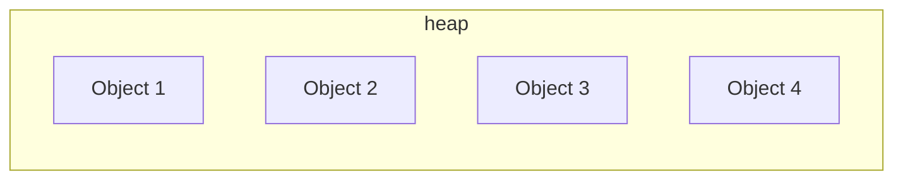

A heap is an area of pre-reserved computer main storage (memory) that a program process can use to store data in some variable amount that won't be known until the program is running. The heap is an area of memory available to allocate areas (“blocks”) of memory for the program. There is some “heap manager” library code which manages the heap for the program. The programmer makes requests to the heap manager, which in turn manages the internals of the heap.



In .NET, the heap is used to allocate memory dynamically for objects at runtime. Whenever an object is created using the new keyword, the .NET runtime allocates memory on the heap to store the object. The heap in .NET is managed by the Common Language Runtime (CLR), which is responsible for managing memory and garbage collection.

The heap in .NET is divided into two main sections:

## .NET Heap sections

### Small Object Heap (SOH)
This is where objects with sizes less than or equal to 85,000 bytes are allocated. The SOH is divided into generations, and objects are initially allocated in the first generation. When the first generation becomes full, objects are promoted to the second generation, and so on. The garbage collector in .NET uses a generational garbage collection algorithm to manage memory on the heap.

### Large Object Heap (LOH)
This is where objects with sizes greater than 85,000 bytes are allocated. The LOH is not divided into generations, and objects are not compacted during garbage collection. Instead, the LOH uses a simple mark-and-sweep algorithm for garbage collection.

In addition to managed objects, the heap in .NET also stores other data structures used by the runtime, such as method tables, sync blocks, and exception objects.

One important thing to note is that while .NET manages memory automatically through its garbage collector, it's still important to write efficient and memory-conscious code to ensure optimal performance and reduce memory usage. This can be done by avoiding unnecessary object allocations, reusing objects where possible, and ensuring that objects are properly disposed of when they are no longer needed.

## Types stored in the heap

In .NET, objects of all types are stored on the heap. This includes:

### Value types 
Value types such as int, float, bool, and structs are stored on the heap if they are declared as objects using the new keyword.

### Reference types
Reference types such as strings, arrays, lists, and classes are always stored on the heap because they are objects that contain reference values.

### Delegates
Delegates are used to represent references to methods with a particular signature, and they are also stored on the heap.

### Objects used by the runtime
The runtime also stores other data structures on the heap, such as method tables, sync blocks, and exception objects.

### Custom objects
Custom objects that are defined in user code, such as classes and structs, are also stored on the heap when they are created.

## Example

For example, consider the following code that creates objects of different types:

```csharp showLineNumbers
int a = 42;         // value type
string s = "hello"; // reference type
object o = new object(); // object type
MyClass c = new MyClass(); // custom class type
```

In this code, the value type int is stored on the stack because it's a local variable with a value that can be directly stored on the stack. However, the reference type string, the object type object, and the custom class type MyClass are all stored on the heap because they are objects that require dynamic memory allocation.

## How it is possible to store value types on the Heap

In .NET, value types such as int are typically stored on the stack when they are declared as local variables within a method, because they have a fixed size and are short-lived. However, value types can also be stored on the heap if they are boxed or allocated dynamically using the new keyword.

```csharp showLineNumbers
object o = 42; // boxing an int value
```

In this code, the int value 42 is boxed by assigning it to an object variable o. When an int value is boxed, it is wrapped in an object on the heap, and a reference to the object is stored on the stack. In this case, the int value 42 is stored on the heap as an object, and the variable o contains a reference to that object.

Similarly, an int value can be allocated dynamically on the heap using the new keyword:

```csharp showLineNumbers
int* p = new int(42); // boxing an int value
```

In this code, the new keyword is used to allocate a new int value with the value 42 on the heap, and a pointer to the allocated value is stored in the variable p. The int value is stored on the heap because it is dynamically allocated using the new keyword. However, this is a low-level technique that is typically used only in unsafe code or in specialized scenarios, and it's not recommended for general use.