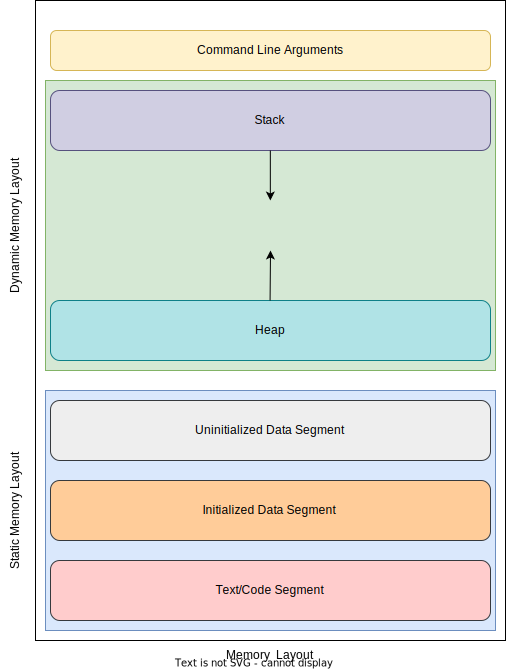

# Intro

Most programming languages manage memory with this structure:

## Text segment

The text/code segment, When we compile any program, creates an executable file like .out, .jar, .exe, etc., that gets stored in the text or code section of the RAM. If we store the instructions in the hard disk, then the speed for accessing the instructions from the hard disk becomes slower because taking the data from the disk will be slower, whereas the RAM is directly connected to the data and address bus so accessing the data from the RAM is faster.

## Data section

The data which we use in our program will be stored in the data section. Since the variables declared inside the main() function are stored in the stack, the variables declared outside the main() method will be stored in the data section. The variables declared in the data section could be stored in the form of initialized, or uninitialized, and it could be local or global. Therefore, the data section is divided into four categories, i.e., initialized, uninitialized, global, or local.

### Uninitialized data segment

The uninitialized data segment is also known as a .bss segment that stores all the uninitialized global, local, and external variables. If the global, static, and external variables are not initialized, they are assigned zero value by default.

The .bss segment stands for Block Started by symbol. The bss segment contains the object file where all the statically allocated variables are stored.

### Initialized data segment

An initialized data segment is also known as a data segment. A data segment is a virtual address space of a program that contains all the global and static variables which are explicitly initialized by the programmer.

## Stack

Is a region of memory that is used for storing temporary data that is created and destroyed in a last-in-first-out (LIFO) manner. This means that the last item to be added to the stack is the first one to be removed. The stack is typically used for storing local variables, function parameters, return addresses, and other data that is only needed temporarily.

## Heap

Is a region of memory that is used for dynamic memory allocation. It is a large pool of memory from which the program can request and release chunks of memory as needed. The heap is typically used for storing data that is needed for longer periods, such as objects and data structures.
