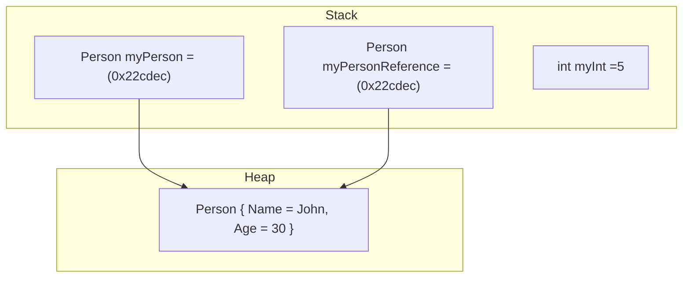
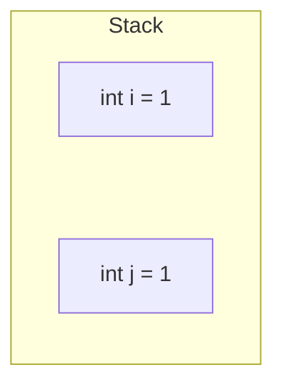
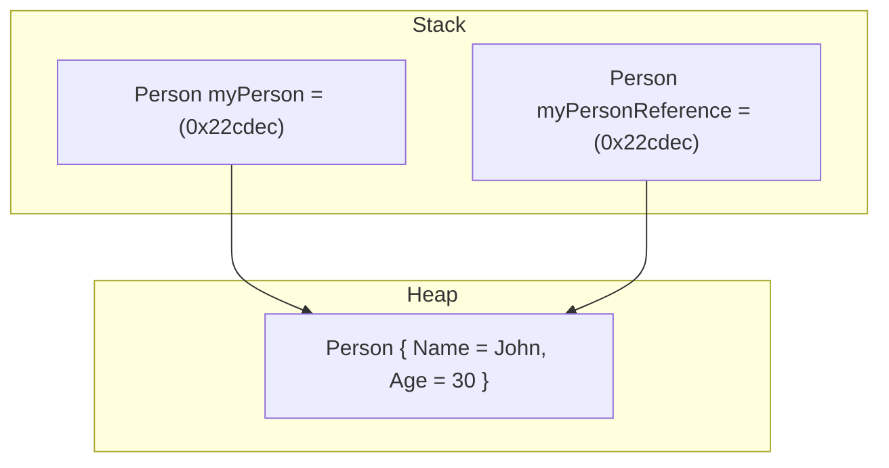
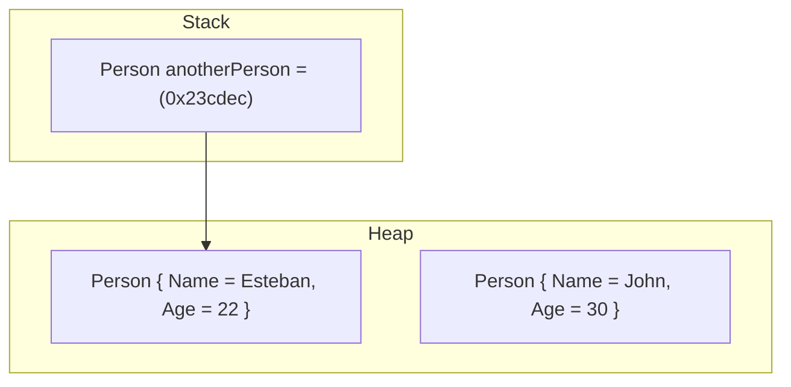
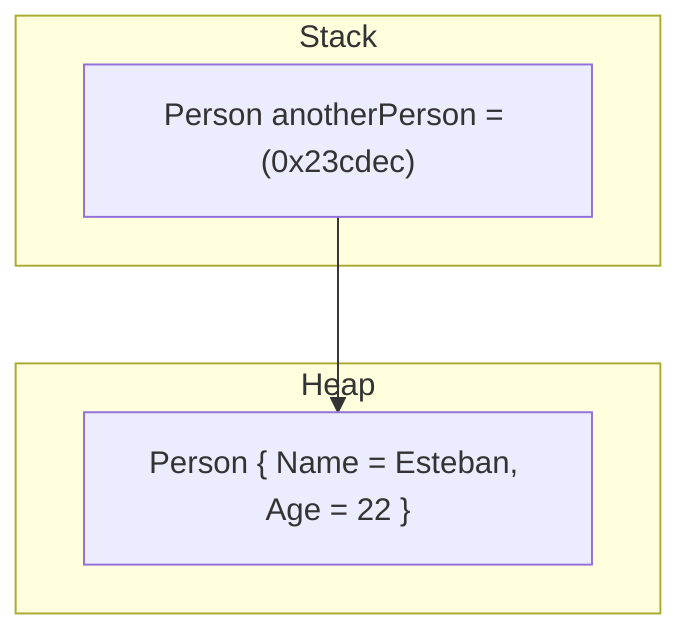
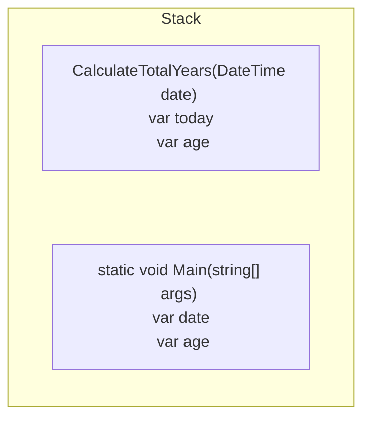
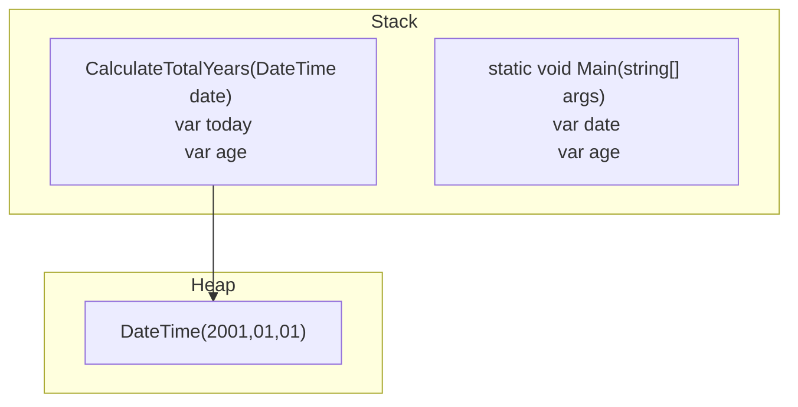
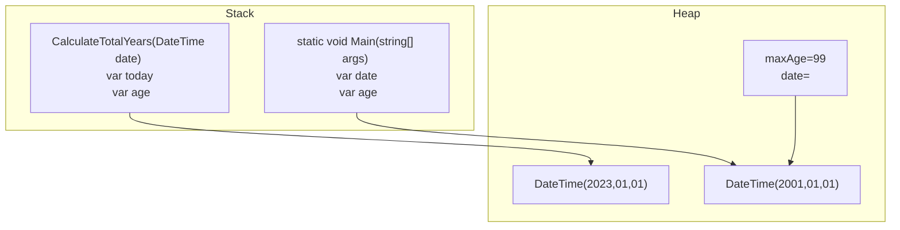
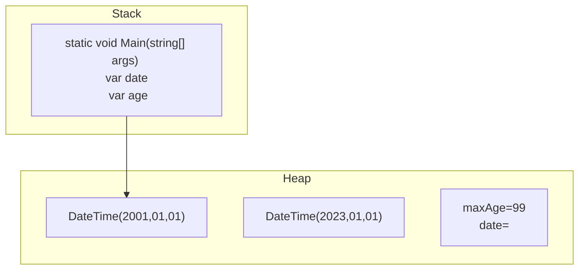

There are two basic categories of data types: value types and reference types.

## Value types 

Represent a value directly, and are stored in a location in memory. Examples of value types include integers, floating point numbers, Booleans, and characters. When a value type is assigned to a variable or passed to a function, a copy of the value is made, and any changes made to the variable or parameter do not affect the original value.

## Reference types

Represent a reference to an object in memory. Examples of reference types include strings, arrays, and custom objects. When a reference type is assigned to a variable or passed to a function, only a reference to the object is copied, not the object itself. This means that any changes made to the object will be reflected in all references to that object.

## Example

```csharp
// Example of a value type:
int myInt = 5;
int myIntCopy = myInt; // Creates a copy of myInt
myIntCopy = 10; // Does not affect myInt

// Example of a reference type:
string myString = "Hello";
string myStringReference = myString; // Creates a reference to myString
myStringReference += ", world!"; // Changes the string, affecting both references

// Example of a custom object reference type:
public class Person
{
    public string Name { get; set; }
    public int Age { get; set; }
}

Person myPerson = new Person { Name = "John", Age = 30 };
Person myPersonReference = myPerson; // Creates a reference to myPerson
myPersonReference.Name = "Jane"; // Changes the name of the person, affecting both references
```

In this example, `int` is a value type, so when myInt is assigned to myIntCopy, a copy of the value of myInt is created. Changes made to myIntCopy do not affect the value of myInt.

In contrast, string and Person are reference types. When myString and myPerson are assigned to myStringReference and myPersonReference, respectively, only a reference to the original object is copied. Changes made to the referenced object (the string or Person instance) will affect both references.



In this case `int` is a valueType because it just represents a value directly because these values are short-lived and have a defined memory size in this case `32-bit` for more information about value types and their size please visit [OfficialDocumentation](https://learn.microsoft.com/en-us/dotnet/csharp/language-reference/builtin-types/value-types#built-in-value-types), but what happens with the objects, the type `object` doesn't have a static size o predefine size like `64-bit` for that reason objects are [referenceTypes](https://learn.microsoft.com/en-us/dotnet/csharp/language-reference/keywords/reference-types) these types uses the heap to store the data itself and uses the stack as ValueType as a pointer to save the Memory Address, for example, the object person is saved on the address `(0x22cdec)`

## Take Care making copies

```csharp

int i = 1;
int j = i;
j++;
Console.WriteLine(i); //prints 1
Console.WriteLine(j); //prints 2
```



If you make a copy with a ValueType it creates the copy and if you modify the value of the original it doesn't affect the copy


But what happens with the ReferenceTypes:

```csharp
Person myPerson = new Person { Name = "John", Age = 30 };
Person myPersonReference = myPerson;
```



```csharp
Person myPerson = new Person { Name = "John", Age = 30 };
Person myPersonReference = myPerson;

myPerson.Name = "Esteban"

Console.WriteLine(myPerson.Name); //Prints Esteban
Console.WriteLine(myPersonReference.Name); //Prints Esteban
```

Modifying the original one affects the copy, that's because the copy has the same MemoryAddress or Reference to the same object

## Object with no reference

When the object has no reference it means that the ValueTypes that stored the memory address were destroyed from the stack making it impossible to access or modify the object.



When this happens the **GarbageCollector** does its job, looking for objects that have no Reference or are impossible to access and destroying them from the Heap.



## Local variables

When you create a local variable in a method is impossible to access these variables outside the method and the reason is because that local variable is stored in the call stack of the method, when the execution is finished the method is destroyed from the stack with its associated variables.



The same happens with ReferenceTypes



When the CalculateTotalYears method is removed from the stack, `DateTime` is no longer accessible and will remain until the garbage collector clears the stack.

## Value Types on Heap

Not all value types live on the stack it depends on how you can declare your variables, [Look at this example](/docs/Memory/Parts/Heap#how-it-is-possible-to-store-value-types-on-the-heap), another example is declaring a global method in your code.

```csharp showLineNumbers {6} 
using System;
namespace Stack
{
    internal class Program
    {
        const int MAX_AGE = 99;
        static void Main(string[] args)
        {
            var date = new DateTime(2001,05,07);
        }
    }
}
```

Using global variables are variables that need to be accessible from different parts of your code, and for that reason need to be created on the heap to still be alive during the class execution or program. Finally, objects that have different ValueTypes like `int`, `float`, and `decimal` are these variables and the object itself lives on the heap.

## Exceptions to the access rule

LocalVariables that have a method are created with the method itself on the stack and cannot be accessible outside the method, but there is an exception and its made by `Anonymous functions`

```csharp showLineNumbers
using System;
namespace Stack
{
    internal class Program
    {
        static void Main(string[] args)
        {
            var date = new DateTime(2001,05,07);
            var maxAge = 99;
            var CalculateTotalYears = () => 
            {
                var today = DateTime.Today;
                var age = today.year - date.year;
                if(date.Date > today.AddYears(-age))
                {
                    age--;
                }
                return age;
            };

            var age = CalculateTotalYears();
            
            if(age >= maxAge)
            {
                Console.WriteLine("Are you sure that this is your age?");
            }else
            {
                Console.WriteLine(age);
            }
        }
    }
}
```



maxAge and date are needed in the Anonymous function and the Main method so is needed to put these variables on the heap. Finally, when the Anonymous function ends all the objects on the heap that don't have a reference are destroyed by the garbage collector.


