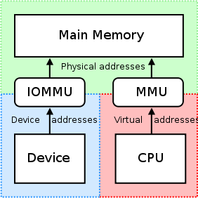

# Virtual Memory

Virtual memory is an essential component of computer architecture that makes use of secondary storage, such as disks, to attain the accessible memory size, which extends the physical memory. It allows an operating system to load programs larger than its physical memory and provides memory protection. The size of the virtual memory storage depends on the addressing scheme used by an operating system and the available secondary memory.

The size of virtual storage is limited by the addressing scheme of the computer system and the amount of secondary memory is available not by the actual number of the main storage locations. 

It is a technique that is implemented using both hardware and software. It maps memory addresses used by a program, called virtual addresses, into physical addresses in computer memory. 

* All memory references within a process are logical addresses that are dynamically translated into physical addresses at run time. This means that a process can be swapped in and out of the main memory such that it occupies different places in the main memory at different times during execution.
* A process may be broken into several pieces and these pieces need not be continuously located in the main memory during execution. The combination of dynamic run-time address translation and the use of a page or segment table permits this.

In modern microprocessors intended for general-purpose use, a memory management unit, or MMU, is built into the hardware. The MMU's job is to translate virtual addresses into physical addresses. A basic example is given below −

The two ways computers handle virtual memory are through paging and segmenting.

* [Paging](https://www.geeksforgeeks.org/paging-in-operating-system/)

* [Segmentation](https://www.geeksforgeeks.org/segmentation-in-operating-system/)
